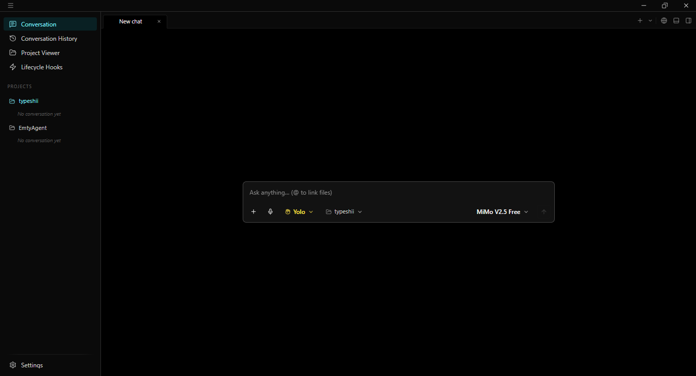
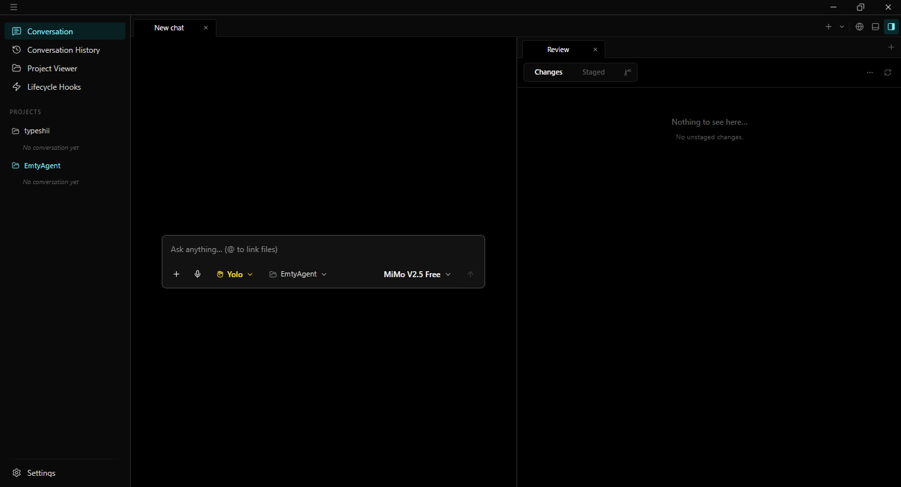
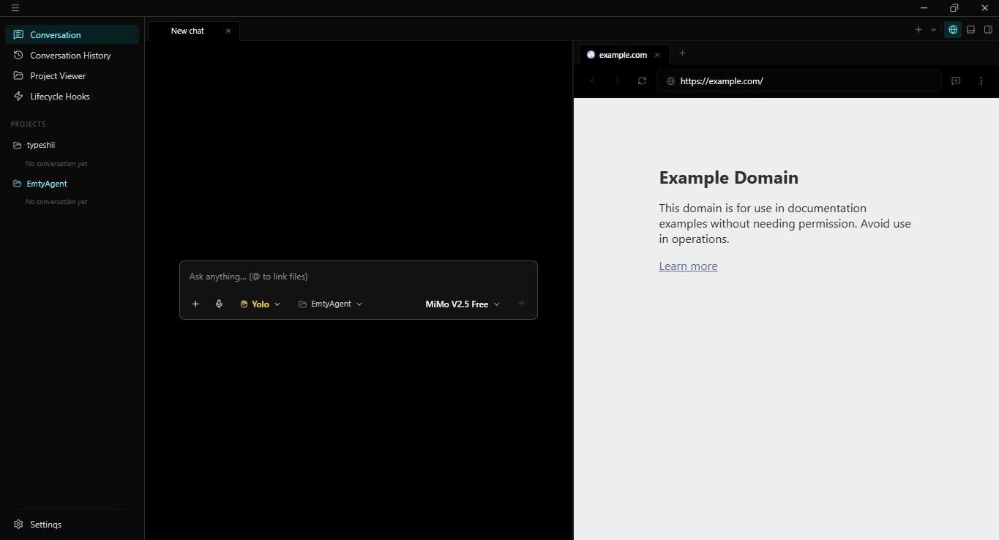
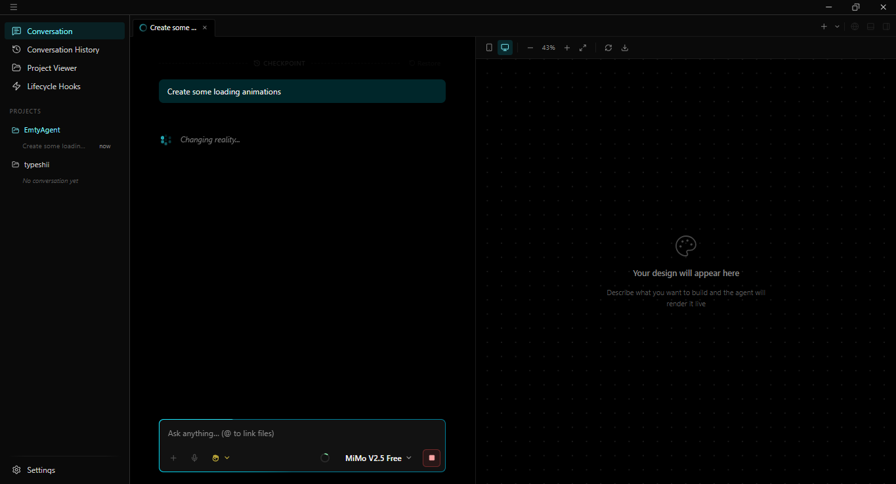
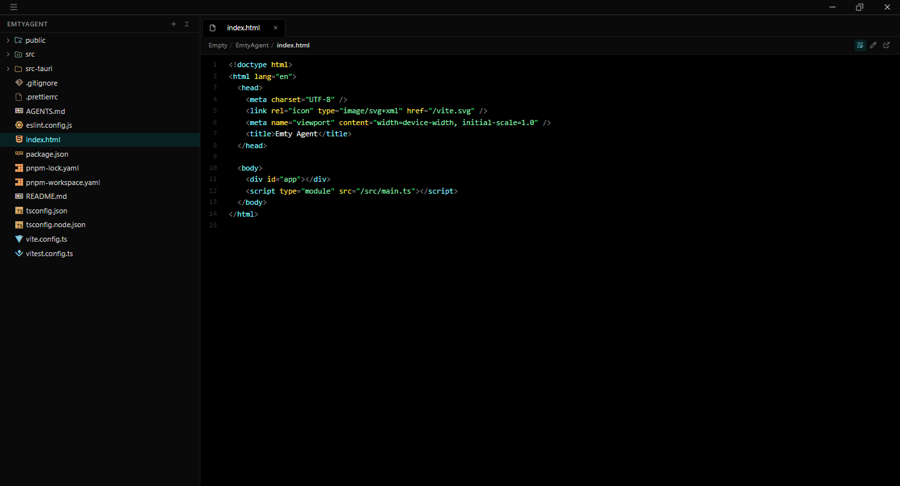

  

  
  
  
  

  
  
  

  
  

This is Emty, a nothing-special coding agent with features every other agent has. It supports as many providers as you can think of — OpenAI-compatible providers, to be precise.

You can have as many sessions as you want, with as many projects as you want (if your PC can handle it, that is — things start to lag with more than 10).

You can customize the UI however you want, and I will continue to improve the "Customization" part of this agent as I learn more. You can even disable tools you don't want the agent to access, disable GitHub co-authorship for the agent if you want, and customize other stuff too.

The agent can use a browser, though it still has some problems which will be fixed in the future as this app gets out of development. It also has web search (with multiple providers and free DDG search by default) and web fetch. The agent can use MCP, so if you want, you can have it use Playwright or cua-driver to control your browser and PC respectively.

There are three permission modes: "Ask", "Auto", and "Yolo", which always ask for permission, let the AI decide, and always skip permission, respectively. I personally use Yolo because it's easy, and it still blocks the BAD-BAD commands like a system nuke or something.

The agent also has subagents and BG (background) commands, which are nice to have. The subagents have personalities like "Explorer", "General", etc., and each has access to certain tools. You currently can NOT disable certain tools for a specific subagent personality — it's not that it's hard to implement, it's that I don't know how to make a good-looking UI for that interface, but don't worry, I'll add it soon.

There are a LOT of minor features like hooks, a built-in terminal, git integration, etc., which I will add to the README as I remember them.

I have also added a compaction system, which isn't the best, to be honest, but I will fix it. I plan to add system prompt editing and better UI customization in the next few updates.

If you want to work on this project and contribute, you can, and I appreciate it a lot. You can also join the Discord if you want to request features — I'll try my best to add them.

Lastly, please report even the SMALLEST issues, bugs, or errors you see to the [Issues](../../issues) tab, as I want to fix them as soon as possible. Thanks for giving this project a look.